## What it is

A small command-line coding agent. Give it a task in plain words and it reads, writes and runs files inside one working folder until the task is done.

## Why I built it

I use AI agents every day and wanted to know what actually happens between the prompt and the answer. The course got me a working loop; the rest is me pushing it further.

## How it works

- The model gets the task plus a list of tools: list files, read a file, write a file, run a Python file.
- Each turn it either calls a tool or answers; tool results go back into the conversation.
- The loop stops when the model answers without calling a tool, or after 20 turns.

## What I learned

- An agent is mostly a loop around tool calls, not magic.
- Tool descriptions matter as much as the prompt.

## My vision (or goal)

- Rebuild it in TypeScript with Effect: every way a step can fail (a missing file, a model timeout, a rate limit) becomes a typed error I have to handle, model calls get retries with backoff, and the tools become swappable services so the loop runs against a fake model in tests.
- Add a web-search tool, so the agent can look things up instead of only touching files in its folder.
- Why Effect: I want to learn how to write async code where failure is part of the design, not an afterthought.
